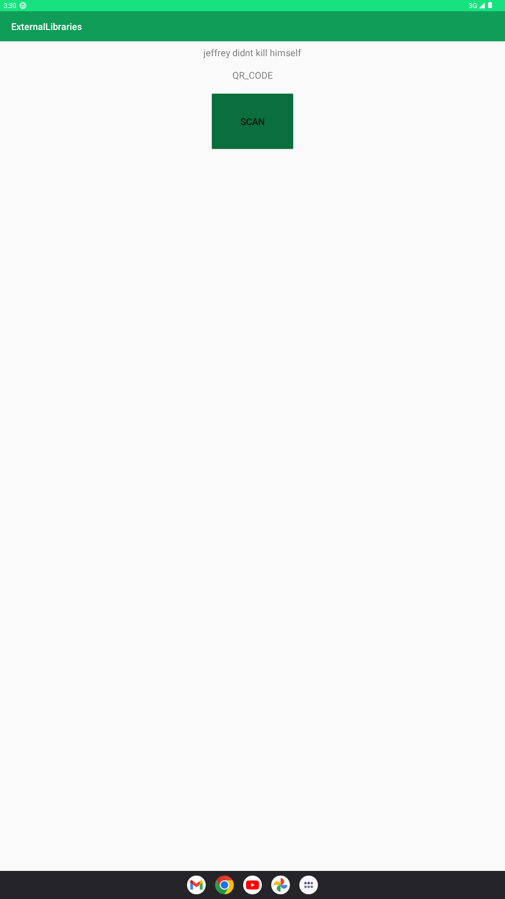

1. startade med att fixa utseendet i appen enligt en guide för att göra en qr-kod läsare. har två stycken textviews, content och format, båda får ny text när man skannar en kod, content får datan av qr-koden, och format säger om man skannat en qr kod eller en barcode. Sedan en knapp som startar kameran och samtidigt qr-kod läsaren 
```
<TextView
        android:id="@+id/textContent"
        android:layout_width="wrap_content"
        android:layout_height="wrap_content"
        android:layout_gravity="center"
        android:layout_margin="10dp"
        android:text="messageContent"
        android:textSize="20sp" />

    <TextView
        android:id="@+id/textFormat"
        android:layout_width="wrap_content"
        android:layout_height="wrap_content"
        android:layout_gravity="center"
        android:layout_margin="10dp"
        android:text="messageFormat"
        android:textSize="20sp" />

    <Button
        android:id="@+id/scanBtn"
        android:layout_width="182dp"
        android:layout_height="130dp"
        android:layout_gravity="center"
        android:layout_margin="10dp"
        android:backgroundTint="#0F9D58"
        android:text="Scan"
        android:textSize="20sp" />`
```

2. i mainactivity.java så lade jag till all logik som hanterar läsaren. 

```
@Override
    protected void onCreate(Bundle savedInstanceState) {
        super.onCreate(savedInstanceState);
        setContentView(R.layout.activity_main);

        scanBtn = findViewById(R.id.scanBtn);
        messageTxt = findViewById(R.id.textContent);
        messageFormat = findViewById(R.id.textFormat);

        scanBtn.setOnClickListener(new View.OnClickListener() {
            @Override
            public void onClick(View view) {
                IntentIntegrator intentIntegrator = new IntentIntegrator(MainActivity.this);
                intentIntegrator.setPrompt("Scan a QR Code");
                intentIntegrator.setOrientationLocked(true);
                intentIntegrator.initiateScan();
            }
        });
    }
```
- när programmet startas så läggs en listener på knappen, när knappen clickas så startas kameran och så kan man skanna en qr-kod

```
@Override
    protected void onActivityResult(int requestCode, int resultCode, @Nullable Intent data) {
        super.onActivityResult(requestCode, resultCode, data);
        IntentResult intentResult = IntentIntegrator.parseActivityResult(requestCode, resultCode, data);
        // if the intentResult is null then
        // toast a message as "cancelled"
        if (intentResult != null) {
            if (intentResult.getContents() == null) {
                Toast.makeText(getBaseContext(), "Cancelled", Toast.LENGTH_SHORT).show();
            } else {
                // if the intentResult is not null we'll set
                // the content and format of scan message
                messageTxt.setText(intentResult.getContents());
                messageFormat.setText(intentResult.getFormatName());
            }
        } else {
            super.onActivityResult(requestCode, resultCode, data);
        }
    }
```
- när man skannat en qr-kod så tar datan ifrån intentintegrator och lägger det i en intentresult. därifrån så ändrar man textviewsen enligt datan.

mainview innan man skannat någonting:


mainview efter man skannat en qr-kod:
